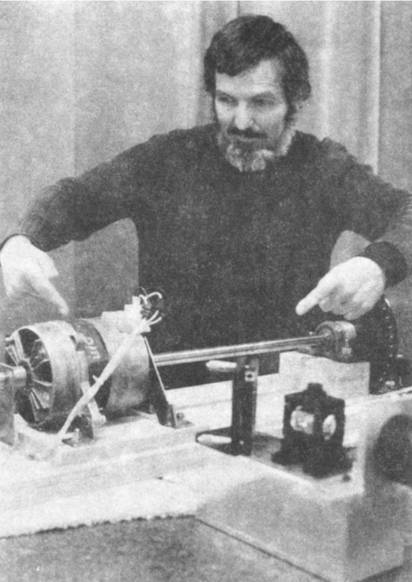

= Новое измерение абсолютной скорости Земли с помощью эксперимента «Связанные затворы»
Стефан Маринов
:nofooter:
:stem:
:stylesheet: styles.css
:toc-title: Содержание
:revdate: 1984
:revremark: Представлено Эрвином Шнебергером
:toc:
:figure-caption: Рисунок
:toc-title: Содержание
:fn-1: footnote:1[Marinov S. Measurement of the one-way speed of light and the Earth’s absolute velocity. Speculations in Science and Technology, 1980, v. 3, 57; Proc. 2nd Marcel Grossmann Meeting on General Relativity, Trieste, 5–11 July, 1979, North-Holland, Amsterdam & New York, 1982, p. 547–550.]
:fn-2: footnote:2[Marinov S. Classical physics. East-West, Graz, 1981.]
:fn-3: footnote:3[Marinov S. The thorny way of truth. East-West, Graz, 1982.]
:fn-4: footnote:4[Chambers R. G. In: Proceedings of ICSTA — Intern. Conference on Space-Time Absoluteness, Genoa, July 1982, eds. S. Marinov and J. P. Wesley, East-West, Graz, 1982, p. 44.]
:fn-5: footnote:5[Marinov S. The velocity of light is direction dependent. Czechoslovak Journal of Physics, 1974, v. B24, 965–970.]
:fn-6: footnote:6[Marinov S. Eppur si muove. C.B.D.S., Brussels, 1977; 2nd and 3rd ed., East-West, Graz, 1981 and 1987 resp.; 4th edition, 2006 (in print).]
:fn-7: footnote:7[Marinov S. Foundations of Physics, 1979, v. 9, 445.]
:fn-8: footnote:8[Marinov S. Abstracts of GR8 — Intern. Conference on General Relativity and Gravitation, Waterloo, Canada, August 1977, p.244.]
:fn-9: footnote:9[Marinov S. Measurement of the laboratory’s absolute velocity. General Relativity & Gravitation, 1980, v. 12, 57–65.]
:fn-10: footnote:10[Marinov S. New Scientist, 1976, v. 71, 662.]
:fn-11: footnote:11[Marinov S. Foundations of Physics, 1976, v. 6, 571.]

Приводится отчет о новом выполнении моего эксперимента «связанные затворы». На этот раз были получены следующие измерения для абсолютной скорости Земли:
скорость 360 ± 40 км/сек с экваториальными координатами направления δ = −24° ± 7°,
α = 12,5 ч ± 1 ч (на февраль 1984 г.).

.Об авторе
****
Стефан Маринов (1931–1997), физик-экспериментатор и теоретик болгарского происхождения, изобрел новый и весьма оригинальный метод измерения анизотропии наблюдаемой скорости света (эксперимент «связанные затворы»). Он сообщил о результатах своего эксперимента в нескольких коротких статьях, опубликованных в рецензируемых журналах (_Physics Letters, General Relativity and Gravitation, Foundations of Physics_ и т. д.). Получив формальное образование, Стефан Маринов с 1960 по 1974 год работал в научно-исследовательском коллективе, а также в качестве доцента на физическом факультете Софийского университета. Находясь там, он разработал и поставил свой первый эксперимент со «cвязанными затворами» и с его помощью обнаружил анизотропию в наблюдаемой скорости света. Его жизнь в Болгарии была трудной: он был заключен в тюрьму в 1966/1967, 1974 и 1977 годах болгарским коммунистическим режимом за неуместное «политическое мышление». В 1977 году Маринов был депортирован из Болгарии как «политический диссидент». Проведя несколько лет в Бельгии, США и Италии, он продолжил свои исследования в Граце, Австрия, который стал для него домом до его трагической смерти в 1997 году. Несмотря на значительное внимание к его эксперименту в 1980-х годах (много статей, обсуждающих его эксперимент, было опубликовано в Nature и других журналах), никто из других ученых не пытался повторить его. С другой стороны, эксперимент прост, дешев и может быть легко повторен в любой хорошо оборудованной физической лаборатории. Поэтому мы публикуем это подробное описание эксперимента, данное самим Мариновым в _Deutsche Physik_ в 1992 году. Редакция надеется, что эта посмертная публикация воодушевит и поможет ученым, которые хотели бы повторить и улучшить эксперимент «связанных затворов». (Эта статья была предоставлена Эрвином Шнеебергером, близким другом доктора Маринова из Граца.)
****

== 1. Введение
Впервые я провел эксперимент «связанные затворы» в 1979 году в Брюсселе {fn-1}{fn-2}. Точности, достигнутой в этом первом эксперименте, было недостаточно для точного определения абсолютной скорости Земли. Таким образом, с помощью этого опыта я мог только установить, что эта скорость не превышает 3000 км/сек. Эксперимент «связанные затворы» относительно прост и дешев{fn-1}{fn-2}, однако ни один ученый в мире не повторил его. Общее мнение, выраженное в многочисленных письмах ко мне, в комментариях рецензентов к моим статьям и в выступлениях на различных конференциях по пространству-времени, которые я посещал или организовывал{fn-3}, состоит в том, что мои эксперименты очень сложны и трудновыполнимы. _Единственное_ обсуждение _в прессе_ по _техническим аспектам_ моих экспериментов было сделано Чемберсом{fn-4}. Здесь я хотел бы процитировать комментарии моего анонимного рецензента по «Основам физики», присланные мне редактором профессором ван дер Мерве 23 июня 1983 г.:

[quote]
Я был проинформирован (имя удалено) из Департамента ВВС, Управления научных исследований ВВС, авиабаза Боллинг, что эксперименты доктора Маринова должны быть повторены Объединенным институтом лабораторной астрофизики. В ответ на запрос я узнал, что JILA не проводит эксперименты, потому что предварительные инженерные исследования показали, что достижение механических допусков, необходимых для обеспечения достоверного результата, выходит за рамки компетенции лаборатории.

После изложения моих возражений о том, что тот факт, что JILA в США не может повторить мои эксперименты, не может рассматриваться как основание для отклонения моих работ по измерению абсолютной скорости, проф. ван дер Мерве прислал мне 24 января 1984 г. вот такой «второй отчет» того же судьи:

[quote]
Сожалею, но я не могу изменить свою рекомендацию относительно работ д-ра Маринова. Пытаясь обосновать достоверность своей экспериментальной работы, д-р Маринов выделяет моменты, которые вызывают множество беспокойства у остального сообщества. Он заявляет: «Если я в подержанной мастерской за две недели за 500 долларов добился необходимой точности, то, полагаю, и JILA сможет её достичь». Я не знаю никого в сообществе точных измерений, кто полагал бы, что измерения качества, заявленные д-ром Мариновым, могут быть осуществлены в таких условиях и в столь короткое время. Чтобы изменить направление физики, потребуется гораздо больше. Я подозреваю, что даже ученые, работающие в самых авторитетных лабораториях США или мира, столкнутся с сильным противодействием, пытаясь опубликовать столь революционные результаты, о которых заявил д-р Маринов.

В этой статье я представляю отчет об измерении абсолютной скорости лаборатории, выполненном мной в Граце с помощью новой конфигурации моего эксперимента «связанные затворы». Теперь установка была построен не за семь дней, а за четыре. Поскольку работа была «в черную» (механик в университетской мастерской делал ее в нерабочее время, и я платил ему «на руки»), установка была построена преимущественно за выходные и стоила 12 000 шиллингов (1000 долларов США). Приводной двигатель был взят от старой стиральной машины и ничего не стоил.

Поскольку ни одна научная лаборатория не проявляла гостеприимства и не давала мне возможности использовать лазерный источник и лабораторные зеркала, моим первым намерением было использовать в качестве источника света Солнце. Зарабатывая себе на хлеб и деньги на продолжение научных исследований, работая конюхом и ночуя в стойле в маленькой деревушке под Грацем, я провел эксперимент на квартире у своей подруги. Чувствительность, которую я получил при солнечном свете (идеальный источник однородного параллельного света), была хорошей, но было два неудобства:
(1) Солнце значительно сдвигается за время изменения вращения оси, и нельзя быть уверенным, вызван ли наблюдаемый эффект временами задержки световых импульсов или движением Солнца; (2) Измерения можно проводить только в течение пары часов около полудня, и поэтому нет возможности получить 24-часовую «синусоиду» (объяснение процедуры измерения следует ниже). С другой стороны, при быстром вращении оси перфорированные вращающиеся диски становились двумя сиренами, так что, когда моя установка начинала свистеть, соседи стучали в дверь, с тревогой спрашивая: «Fliegt schon der Russe uber Wien?» (Иван уже летает над Веной?). После нескольких препирательств моя подруга выкинула из своей квартиры не только мою установку, но и меня.

Однако позже я нашел возможность провести эксперимент в лаборатории <<fig-1, (рис. 1)>>. Схема эксперимента, его теоретическая основа и процедура измерения точно такие же, как и для брюссельского варианта {fn-1}{fn-2}. Так как описание предельно простое и краткое, я приведу его и здесь, отметив, что установка лазера и зеркал на лабораторном столе заняла два часа.

Но сначала, следуя примеру _Nature_, приводящего интересные цитаты из своих изданий многолетней давности, я тоже хотел бы привести цитату:
[quote]
Если бы можно было с достаточной точностью измерить скорость света, без возвращения луча в исходную точку, то проблема измерения порядка скорости Земли относительно эфира была бы решена. Это может быть не так безнадежно, как может показаться на первый взгляд, поскольку трудности чисто механические и, возможно, со временем могут быть преодолены.

Имена авторов — Майкельсон и Морли, год публикации — 1887. Это статья, в которой Майкельсон и Морли рассказывают об историческом эксперименте по «измерению» двусторонней скорости света. Статья была опубликована в двух журналах: _The Philosophical Magazine_ и _American Journal of Science_. Высказав это мнение, Майкельсон и Морли предложили эксперимент, почти _такой же_, что и мой эксперимент со «связанными зеркалами»{fn-5}{fn-6}{fn-2}. Они предложили использовать метод моста с двумя селеновыми ячейками, где для выставления нуля используется телефон. Я должен подчеркнуть, что мне не удалось найти _ни одну_ статью или книгу, посвященную историческому эксперименту Майкельсона-Морли, где была бы дана информация об их «одностороннем» предложении. Замечу, что в эксперименте Майкельсона-Морли двухсторонняя скорость света сравнивается для двух взаимно перпендикулярных направлений, но не измеряется её значение.

[#fig-1]
.Грацский эксперимент со «связанными затворами» во время предварительных измерений с воздухом; при проведении измерений в вакууме лазер устанавливался параллельно оси, а регулятор скорости мотора (видимый между мотором и дальним диском) выносился за пределы  пространства с вакуумом. В левом углу основания установки видно гнездо для одного из отражающих зеркал на тот случай, если необходимо использовать солнечный свет (гнездо другого отражающего зеркала находится в дальнем правом углу). Механик потратил много времени (а я потерял деньги) на изготовление неиспользуемых в лазерной установке *регулируемых* отражающих зеркал для солнечного света, так что цена реальной уставновки должна быть меньше раза в два.
image::img/1.png[]

== 2. Теория эксперимента со «связанными затворами»

Вращающаяся ось приводится в движение электродвигателем, расположенным точно посередине оси. Ось имеет на концах два диска с отверстиями. Расстояние от центров отверстий до центра оси равно stem:[R], а расстояние между дисками равно stem:[d]. Свет от лазера разделяется полупрозрачной призмой и два луча направляются парой регулируемых зеркал к противоположным концам вращающейся оси, после чего лучи проходят через отверстия дисков во взаимно противоположных направлениях. Любой из лучей после «нарезания» ближним диском и «подрезки» дальним диском освещает фотоэлемент. С помощью гальванометра измеряется разница токов, генерируемых обоими фотоэлементами. При закрытии одной из ячеек измеряется ток, производимый другой ячейкой.

Лазерный луч располагается относительно отверстий дисков таким образом, что когда ось находится в состоянии покоя, свет лазера, проходящий через ближнее отверстие, освещает _половину_ дальнего отверстия. Затем ось приводится во вращение, с постепенным увеличением скорости. Так как световые импульсы, срезанные ближними отверстиями, тратят время для  достижения дальних отверстий, то с увеличением скорости вращения все меньше и меньше света будет проходить через дальние отверстия, когда они «уходят» от луча, и, наоборот, все больше и больше света будет проходить через дальние отверстия, когда они «входят» в положение луча. Для краткости я буду называть первый вид дальних отверстий «уходящими», а второй - «входящими».

Если предположить, что отверстия, а также поперечные сечения лучей имеют прямоугольную форму, а освещение однородно, то ток stem:[I_(hom)], создаваемый любым из фотоэлементов, будет пропорционален ширине светового пятна stem:[b], измеренной на поверхности фотоэлемента при вращении оси, т. е. stem:[I_(hom) ∼ b]. При увеличении скорости вращения оси на stem:[ΔN], ширина светового луча, проходящего через «уходящие» отверстия, станет stem:[b − Δb], ширина светового луча, проходящего через «входящие» отверстия будет stem:[b + Δb], а производимые токи станут stem:[I_(hom) − ΔI ∼ b − Δb], stem:[I_(hom) + ΔI ∼ b + Δb]. Таким образом
[stem#f1]
.(1)
++++
Δb = b (ΔI)/I_(hom),
++++
где stem:[ΔI] это _половина_ от _изменения_ в _разнице токов_ от фотоэлементов.

Если вращать ось сначала на stem:[ΔN / 2] оборотов против часовой стрелки, а затем на stem:[ΔN / 2] по часовой стрелке, это соответствует изменению скорости вращения на stem:[ΔN]. Поскольку
[stem#f2]
.(2)
++++
Δb = (d//c) π ΔNR,
++++
(здесь потеряли 2 перед stem:[π], но в следующей формуле она на месте - _прим. переводчика_)

то для односторонней скорости света получаем
[stem#f3]
.(3)
++++
c = (2π ΔNRd) / b I_(hom)/(ΔI)
++++

В моем эксперименте отверстия, как и световые лучи, были круглыми, а не прямоугольными. Следовательно, вместо измеряемой ширины светового пятна приходится брать некоторую _немного другую_ «эффективную» ширину. Так как ширина stem:[b] никогда не может быть точно измерена, обсуждение разницы между реальной шириной и «эффективной» шириной бессмысленно. Однако гораздо важнее то, что освещенность в сечениях лучей была неоднородной: в центре она была максимальной, а на периферии минимальной.

Thus the simplified relation <<f1>> did not correspond to reality
if under stem:[I_(hom)] one would understand the measured current. I
shall give here a certain amelioration of formula <<f1>>, which
was omitted in {fn-1}, because of a fear that the presumed
referee would consider my analysis as an «artificial speculation»
in a search «to adapt the observed values to the
theoretical formula». Now I am no more afraid of the referee.
The illumination will be assumed to increase _linearly_ from
zero on the periphery of the light beam to a maximum at its
center where the beam is «cut» by the holes’ rims. The _real_
current stem:[I] which one measures is proportional to a certain
_middle_ illumination across the whole light beam, while the
_real_ current stem:[ΔI] is proportional to the _maximum_ illumination
at the centre of the light beam. On the other hand, one must
take into account that when the holes let the light beam fall
on the photocell, first light comes from the peripheral parts
and at the end from the central parts. When half of the beam
has illuminated the photocell, the «left» part of the beam
begins to disappear and its «right» part begins to appear,
the breadth remaining always _half_ of the beam. Then the
holes’ rims begin to extinguish first the central parts of the
beam and at the end the peripheral parts. Here, for simplicity,
I suppose that the cross-sections of the beams and of the
holes are the same (in reality the former were smaller than
the latter). Thus during the first one-third of the time of
illumination the «left» half of the light beam appears, during
the second one-third of the time of illumination the «left»
half goes over to the «right» half, and during the last
one-third of the time of illumination the «right» half disappears.
Consequently, the _real_ current, stem:[I], produced by the photocell
will be related to the _idealized_ current, stem:[I_(hom)], corresponding
to a _homogeneous illumination with the central intensity_ and
_generated by a light spot having the half-breadth of the
measured one_, by the following connection

[stem#f4]
.(4)
++++
I = 1/2 int_0^1 I_(hom) x ( 2/3 − x/3 ) dx =
I_(hom)/6 (x^2 − x^3 / 3) |_0^1
= I_(hom) / 9 .
++++

In this formula stem:[I_(hom)dx] is the current produced by a
strip with breadth stem:[dx] of the light beam; at the periphery
of the beam (where stem:[x = 0]) the produced current is zero
and at the centre (where stem:[x = 1]) it is stem:[I_(hom)dx]. The current
stem:[I_(hom)dx] is produced (i.e. the corresponding photons strike
the photocell) during time stem:[2/3 − x/3 ;] for the periphery of the
beam this time is stem:[2/3 − 0/3 = 2/3] and for the centre of the beam
this time is stem:[2/3 − 1/3 = 1/3] . The factor stem:[1/2] before the integral is
present because the _measured_ breadth of the light spot over
the photocell is _twice_ its _working_ breadth. Putting <<f4>> into
<<f3>>, one obtains
[stem#f5]
.(5)
++++
c = (2πΔNRd)/b (9I) / (ΔI).
++++

According to my absolute space-time theory {fn-2}{fn-6}{fn-7}
(and according to anybody who is acquainted _even superficially_
with the experimental evidence accumulated by humanity),
if the _absolute velocity’s component_ of the laboratory
along the direction of light propagation is stem:[v], then the velocity
of light is stem:[c − v] along the propagation direction and stem:[c + v]
against. For these two cases formula <<f5>> is to be replaced by
the following two

[stem#f6]
.(6)
++++
c - v = (2πΔNRd)/b (9I) / (ΔI + δI),

c + v = (2πΔNRd)/b (9I) / (ΔI - δI),
++++
where stem:[ΔI + δI] and stem:[ΔI − δI] are the changes of the currents
generated by the photocells when the rate of rotation changes
by stem:[ΔN]. Dividing the second formula <<f6>> by the first one, one
obtains

[stem#f7]
.(7)
++++
v = ((δI) / (ΔI)) c.
++++

Thus the measuring method consists of the following:
One changes the rotational rate by stem:[ΔN] and measures the
change in the current of either of the photocells, which is
stem:[ΔI ≃ ΔI ± δI]; then one measures the difference of these
two changes which is stem:[2δI]. I made both these measurements
by a differential method with the same galvanometer, applying to it the difference of the outputs of both photocells.
To measure stem:[2ΔI] I made the far holes for one of the beam
«escaping» and for the other «entering». To measure stem:[2δI]
I made all far holes «escaping» (or all «entering»).

== 3. Measurement of stem:[c]
In the Graz variation of my «coupled-shutters» experiment I
had: stem:[d = 120] cm, stem:[R = 12] cm. The light source was an Ar
laser, the photocells were silicon photocollectors, and the
measuring instrument was an Austrian «Norma» galvanometer. I measured stem:[I = 21] mA (i.e., stem:[I_(hom) = 189] mA) at a rotational rate of 200 rev/sec. Changing the rotation from clockwise to counter-clockwise, i.e., with stem:[ΔN = 400] rev/sec, I
measured stem:[ΔI = 52.5] μA (i.e., the measured change in the
difference current at «escaping» and «entering» far holes was
stem:[2ΔI = 105] μA). I evaluated a breadth of the light spot
stem:[b = 4.3±0.9] mm and thus I obtained stem:[c = (3.0±0.6)×10^8] m/sec,
where error is taken as only the error in the estimation of stem:[b],
because the «weights» of the errors introduced by the measurement
of stem:[d, R, ΔN, I, ΔI] were much smaller. I repeat,
the breadth stem:[b] cannot be measured exactly as the peripheries
of the light spot are not sharp. As a matter of fact, I chose
such a breadth in the possible uncertainty range of stem:[±1] mm,
so that the exact value of stem:[c] to be obtained. I wish once more
to emphasize that the theory for the measurement of stem:[c] is
built on the assumption of rectangular holes and light beams
cross-sections and linear increase of the illumination from
the periphery to the center. These simplified assumptions
do not correspond to the more complicated real situation.
Let me state clearly: The «coupled shutters» experiment is
not to be used for an _exact_ measurement of stem:[c]. It is, however,
to be used for sufficiently accurate measurement of the
variations of stem:[c] due to the absolute velocity of the laboratory
when, during the different hours of the day, the axis of the
apparatus takes different orientations in absolute space due
to the daily rotation of the Earth (or if one would be able to
place the set-up on a rotating platform). The reader will see
this now.

== 4. Measurement of stem:[v]
The _measurement_ of stem:[c] is an absolute, while the measurement
of stem:[v] is a _relative_, taking the velocity of light stem:[c] as known.
According to formula <<f7>> one has to measure only two difference currents:
stem:[2ΔI] (at «escaping» and «entering» far holes)
and stem:[2δI] (at «escaping» or «entering» far holes).
The measurement in the air of the laboratory had two important inconveniences:
(1) Dust in the air led to very big fluctuations in the measured current differences and I had to use a big condenser in parallel with the galvanometer’s entrance, making the apparatus very sluggish;
(2) The shrill of the holed disks at high rotational rate could lead to the same gloomy result as
when executing the experiment in the apartment of my girlfriend. Thus I covered the whole set-up with a metal cover
and evacuated the air by using an oil pump (this amelioration
cost an additional 9,000 Shilling, i.e. USD 700). The performance of the experiment in vacuum has also the advantage that those people who wish to save at any price the false
dogma of the constancy of the velocity of light, cannot raise
the objection that the observed effect is due to temperature
disturbances.

The measurement of stem:[ΔI] is a simple problem as the effect
is _huge_. Moreover all existing physical schools cannot raise
objections against the theory presented above. However, the
measurement of stem:[δI] which is with three orders lower than
stem:[ΔI] has certain peculiarities which must be well understood.
When changing the rotation from clockwise to counterclockwise, the current produced by the one photocell changes,
say, from stem:[I_1] to stem:[I_1 + ΔI_1 + δI_1] and of the other photocell
from, say, stem:[I_2] to stem:[I_2 + ΔI_2 − δI_2]. One makes stem:[I_1] to be equal
to stem:[I_2], changing the light beam positions by manipulating the
reflecting mirrors micrometrically. One can with difficulty
obtain an exact compensation, so that the galvanometer shows
a certain residual current stem:[I']. The current change stem:[ΔI_1] will be
equal to the current change stem:[ΔI_2] only if the experiment is
_entirely symmetric_. But it is difficult to achieve a complete
symmetry (and, of course, I could not achieve it in my
experiment). There are the following disturbances: On the
one hand, the distribution of the light intensities in the
crosssections of both beams and the forms of the beams are not
exactly the same; thus the covering of the same geometrical
parts of both beams when changing the rotation of the axle
does not lead to equal changes in the light intensities of
both beams and, consequently, to stem:[ΔI_1 = ΔI_2]. On the other
hand, although the photocells were taken from a unique
Sun collector cut in two pieces, even if the changes in the
illuminations should be equal, the produced currents may
become different (the current gain at the different points
of the photocells is not the same, the internal resistances
of the cells are not equal, etc. etc.). Thus after changing
the rotational rate from clockwise to counter-clockwise, I
measured certain current stem:[I''], but stem:[I'' − I'] was not equal to
stem:[2δI], as it _must be_ for an entirely symmetric setup. However,
measuring the difference stem:[I'' − I'] during different hours of
the day, I established that it was «sinusoidally modulated».
This «sinusoidal modulation» was due to the absolute velocity stem:[v].
All critics of my «rotating axle» experiments vociferate
mostly against the vibrations of the axle, asserting that these
vibrations will mar the whole measurement. Meanwhile the
axle caused me _absolutely no troubles_. When measuring in
vacuum the axis of the apparatus pointed north/south.

I measured the «sinusoidal modulation» over 5 days,
from the 9th to the 13th February 1984. As I did the experiment alone,
I could not cover all 24 hours of every day.
The results of the measurements are presented in <<fig-2,Fig. 2>>. The
most sensible scale unit of the galvanometer was 10 nA and
the fluctuations were never bigger than 20 nA. The daytime
hours are on the abscissa and the current differences on the
left ordinate. After plotting the registered values of stem:[I'' − I']
and drawing the best fit curve, the «null line» (i.e., the
abscissa) is drawn at such a «height» that the curve has
to cut _equal_ parts of the abscissa (of any 12 hours). Then
on the right ordinate the current stem:[2δI] is taken positive
upwards from the null line and negative downwards. Since
105 μA corresponds to a velocity 300,000 km/sec, 10 μA
will correspond approximately to 30 km/sec. Considering
the fluctuations of the galvanometer as a unique source of
errors, I took ±30 km/sec as the uncertainty error in the
measurement of stem:[v].

[#fig-2]
.Measurement of stem:[2δI]. The points give the measurements at the even hours for the days from the 9th to the 13th February 1984.
image::img/2.png[]

When stem:[2δI] has maximum or minimum the Earth’s absolute
velocity lies in the plane of the laboratory’s meridian
<<fig-3,(Fig. 3)>>. The velocity components pointing to the north are
taken positive and those pointing to the south negative. I
always denote by stem:[v_a] the component whose algebraic value
is smaller. When both light beams pass through «escaping»
holes, then, in the case that the absolute velocity component
points to the north, the «north» photocell produces less
current than the «south» photocell (with respect to the case
when the absolute velocity component is perpendicular to
the axis of the apparatus), while in the case that the absolute
velocity component points to the south, the «north» photocell
produces more current. If the light beams pass through «entering»
holes, all is vice versa. Let me note that for the case
shown in <<fig-3,Fig. 3>> (which does not correspond to the real situation,
as in reality stem:[v_a] is negative) both velocity components
point to the north and both stem:[v_a] and stem:[v_b] are positive. In this
case the «variation curve» no longer has the character of a
«sinusoid»; it has 4 extrema (for 24 hours) and the «null line»
must be drawn tangentially to the lowest minimum.

[#fig-3,align="center"]
.The Earth and its absolute velocity at the two moments when the laboratory meridian lies in the velocity’s plane
image::img/3.png[]

As can be seen from <<fig-3,Fig. 3>>, the two components of
the Earth’s absolute velocity in the horizontal plane of the
laboratory, stem:[v_a] and stem:[v_b], are connected with the magnitude stem:[v]
of the absolute velocity by the following relations
[stem#f8]
.(8)
++++
v_a = v sin (δ − φ),

v_b = v sin (δ + φ),
++++

where stem:[φ] is the latitude of the laboratory and stem:[δ] is the declination of the velocity’s apex. From these one obtains

[stem#f9]
.(9)
++++
v = ({v_a^2 + v_b^2 − 2v_av_b (cos^2φ − sin^2φ)}^(1/2)) / (2 sin φ cos φ),

tan δ = (v_b + v_a) / (v_b − v_a) tan φ .
++++

Obviously the apex of stem:[v] points to the meridian of stem:[v_a].
Thus the right ascension stem:[α] of the apex equaled the local
sidereal time of registration of stem:[v_a]. From <<fig-2,Fig. 2>> it is to be
seen that this moment can be determined with an accuracy
of stem:[±1^h]. Thus it was enough to calculate (with an inaccuracy
not larger than stem:[±5] min) the sidereal time stem:[t_(si)] for the meridian
where the local time is the same as the standard time stem:[t_(st)] of
registration, taking into account that the sidereal time at a
middle midnight is as follows:

[.scrollable]
--
[cols="1,1",frame=none,grid=none]
|===

| 22 September — stem:[0^h]
| 23 March — stem:[12^h]

| 22 October — stem:[2^h]
| 23 April — stem:[14^h]
| 23 April — stem:[14^h]

| 22 November — stem:[4^h]
| 23 May — stem:[16^h]

| 22 December — stem:[6^h]
| 22 June — stem:[18^h]

| 21 January — stem:[8^h]
| 23 July — stem:[20^h]

| 21 February — stem:[10^h]
| 22 August — stem:[22^h]
|===
--

The graph in <<fig-2,Figure 2>> shows that on the 11th February
(the middle day of observation) I registered in Graz
stem:[(φ = 47^@, δ = 15^@ 260')] the following components of the absolute
velocity at the following hours (for stem:[2 (δI)_a = −120]nA, and
stem:[2 (δI)_b =50]nA)

[stem#f10]
.(10)
++++
v_a = −342 ± 30 "km/sec", (t_(st))_a = 3^h ± 1^h,

v_b = +143 ± 30 "km/sec", (t_(st))_b = 15^h ± 1^h,
++++
and formulae <<f9>> give

[stem#f11]
.(11)
++++
v = 362 ± 40 "km/sec",

δ = −24^@ ± 7^@, α = (t_(si))_a = 12.5^h ± 1^h.
++++
where the errors are calculated supposing stem:[φ = 45^@].

The local sidereal time for the observation of stem:[v_a] (i.e., the
right ascension of the absolute velocity’s apex)
was calculated in the following manner: As for any day the sidereal
time increases by stem:[4^m] (with respect to the solar time),
the sidereal time at midnight on the 11th February (which follows
21 days after midnight on the 21 January) was stem:[8^h+1^h 24^m = 9^h 24^m].
At stem:[3^h] middle European (i.e., Graz) time on the
11th February the local sidereal time on the 15th meridian
was stem:[9^h 24^m + 3^h = 12^h 24^m]. On the Graz meridian the local
sidereal time was stem:[12^h 24^m + 2^m = 12^h 26^m ≃ 12.5^h].

*Important remark.* I now establish that when calculating
the local sidereal time of observation of stem:[v_a] for my interferometric
«coupled mirrors» experiment {fn-2}{fn-6}{fn-8}{fn-9}, I made a
very _unpleasant error_. As Sofia stem:[(λ = 23^@ 210')] lies westwards
from the middle zonal meridian stem:[(λ = 30^@)], I had to _subtract_
the difference of stem:[6^@ 390'], which corresponds to stem:[27^m], from the
local sidereal time of the zonal meridian. Instead of doing
this, I _wrongly_ added. Thus the numbers given by me are to
be corrected as follows:

[.scrollable]
--
[cols="1,1*>,1*>",frame=none,grid=none]
|===
| Observation: | Wrongly calculated: | To be corrected to:
| 12 July 1975
| stem:[(t_(si))_a=14^h 23^m]
| stem:[(t_(si))_a=13^h 30^m]

|11 January 1976
|stem:[(t_(si))_a=14^h 11^m]
|stem:[(t_(si))_a=13^h 17^m]

|Right ascension of the apex of the Sun’s absolute velocity
|stem:[α=14^h 17^m]
|stem:[α=13^h 23^m]
|===
--

I beg the persons who will refer to the measurement of
the Sun’s absolute velocity determined by me in 1975/76
to cite _always_ the corrected figures given here and not the
wrongly calculated figures presented in {fn-2}{fn-6}{fn-8}{fn-9}{fn-10}{fn-11}
and in some others of my papers.

== 5. Conclusions

Comparing the figures obtained now by the Graz variation of
my «coupled shutters» experiment with the figures obtained
some ten years ago in Sofia by the interferometric «coupled
mirrors» experiment, one sees that within the limits of the
supposed errors they overlap. Indeed, on the 11 January 1976
I registered in Sofia the following figures

[stem#f12]
.(12)
++++
v = 327 ± 20 "km/sec",

δ = −21^@ ± 4^@," " α = 13^h 17^m ± 20^m.
++++

As for the time of one month the figures do not change
significantly, one can compare directly the figures <<f11>> with
the figures <<f12>>. The declinations are the same. As the Graz
measurements were done every two hours, the registration of
the right ascension was not exact enough and the difference
of about one hour is not substantial. I wish to point only to
the difference between the magnitudes which is 35 km/sec. I
have the intuitive feeling that the figures obtained in Sofia
are more near to reality. The reason is that _I profoundly
believe in the mystique of the numbers_, and my Sofia measurements
led to the magic number 300 km/sec for the Sun’s
absolute velocity (which number is to be considered together
with 300,000 km/sec for light velocity and 30 km/sec for the
Earth’s orbital velocity). The Graz measurement destroys
this mystic harmony.

The presented account on the Graz «coupled shutters»
experiment shows that the experiment is _childishly simple_, as
I always asserted{fn-1}{fn-2}. If the scientific community refuses
to accept my measurements for so many years and nobody
tries to repeat them, the answer can be found in the following
words of one of my _best physical and moral teachers_:

[quote,Albert Einstein]
*Terrible is the power which an authority exerts over the world.*

I wish to add in closing that with a letter of the 29 December 1983 I informed the Nobel committee that I am ready
at any time to bring (for my account) the «coupled shutters»
experiment to Stockholm and to demonstrate the registration
of the Earth’s absolute motion. With a letter of 28 January
1984 Dr. B. Nagel of the Physics Nobel committee informed
me that my letter had been received.

[#fig-4,align="center"]
.February 1984. Explaining the essence of the «coupled shutters» experiment. My fingers show the ways in which both light beams go from the one perforated disk to the other. One can see on the photograph only a small part of the laser producing the initial light beam which is split by the semitransparent mirror seen in the photograph. The reflected beam goes to the left, while the refracted beam, after a reflection on the mirror seen in the photograph, goes to the right. Between the perforated disks, these two beams proceed in the opposite directions. The person who gave me a possibility to carry out my «coupled shutters» experiment in his laboratory took from me the solemn promise that I shall never say where have I carried it out. To my question, why is he so afraid, the answer was: «I do not wish one day to be poisoned by certain special services.»
